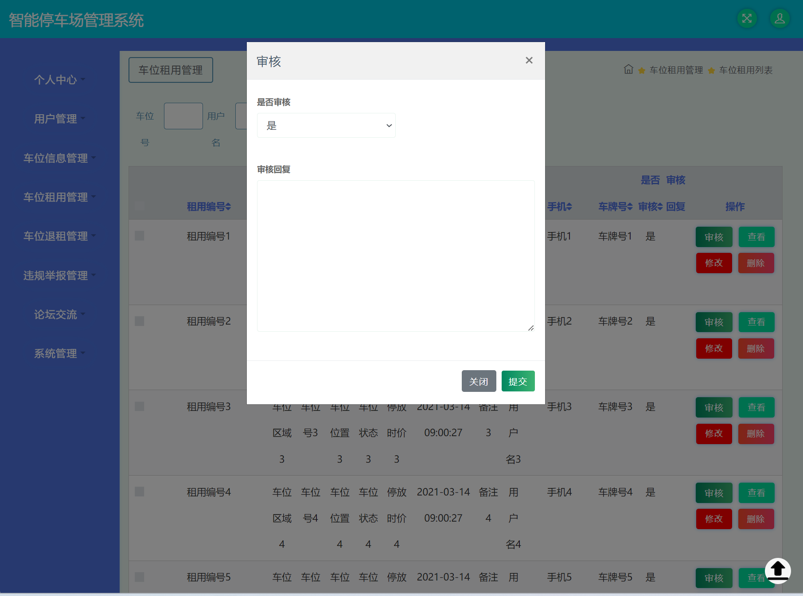
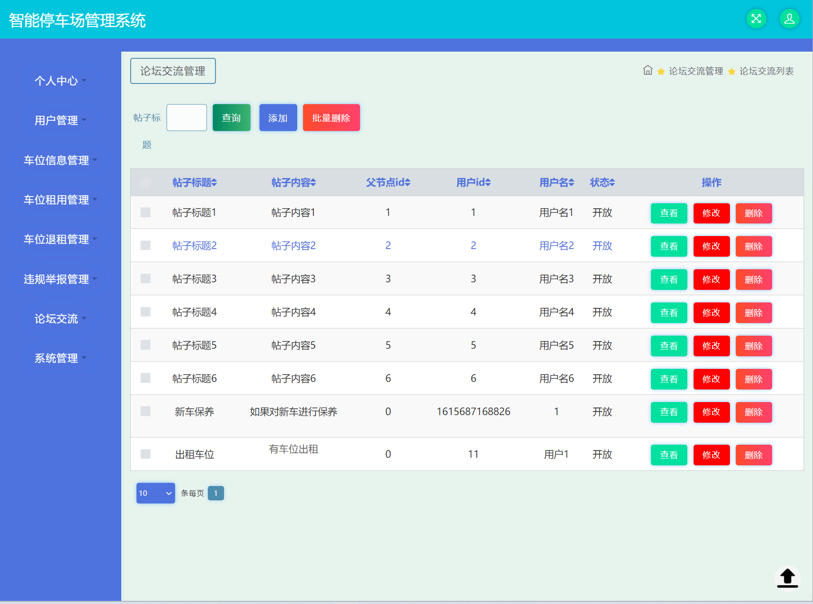

### 作者QQ：1556708905(支持修改、 部署调试、 支持代做毕设)

#### 支持代做任何毕设论、接网站建设、小程序、H5、APP、各种系统等

**毕业设计所有选题地址 [https://github.com/zhengjianzhong0107/allProject](https://github.com/zhengjianzhong0107/allProject)**

**[博客地址](https://blog.csdn.net/2303_76227485/article/details/128647271)**

**视频演示：
[https://www.bilibili.com/video/BV15s4y1F7m9/](https://www.bilibili.com/video/BV15s4y1F7m9/)**

## 基于Springboot/ssm的智能停车场管理系统(源代码+数据库+11000字文档+ppt)623

## 一、系统介绍

本系统分为管理员与普通用户两种角色(本项目有springboot和ssm两种版本)

用户角色包含以下功能：

- 登录、注册、系统公告查看、车位信息查看/评论/收藏/租用、社区论坛交流、联系客服、个人中心、密码修改

管理员角色包含以下功能：

- 登录、用户管理、车位管理、车位租用管理、车位退租管理、未归举报管理、论坛交流管理、
- 公告管理、在线客服、个人中心、密码修改、轮播图管理

## 二、所用技术

后端技术栈：

- Springboot
- ssm
- mybatisPlus
- mysql
- tomcat8

前端技术栈：

- jsp
- bootstrap
- elementui

## 三、环境介绍

基础环境 :IDEA/eclipse, JDK 1.8, Mysql5.7及以上,tomcat8,Maven3.6

所有项目以及源代码本人均调试运行无问题 可支持远程调试运行

## 四、页面截图

## 五、浏览地址

- 前台访问路径：http://localhost:8080/jspmn576i/front/index.jsp
- 后台访问路径：http://localhost:8080/jspmn576i/jsp/login.jsp
  
  账号密码：
- 管理员  abo/abo
- 用户    用户1/123456

## 六、安装教程

1. 使用Navicat或者其它工具，在mysql中创建对应名称的数据库，并执行项目的sql文件里面的sql；
2. 使用IDEA/Eclipse导入项目，导入时，若为maven项目请选择maven; 等待依赖下载完成；
3. 修改config.properties 里面的数据库配置
4. 将项目加载到tomcat8里面，启动项目 
